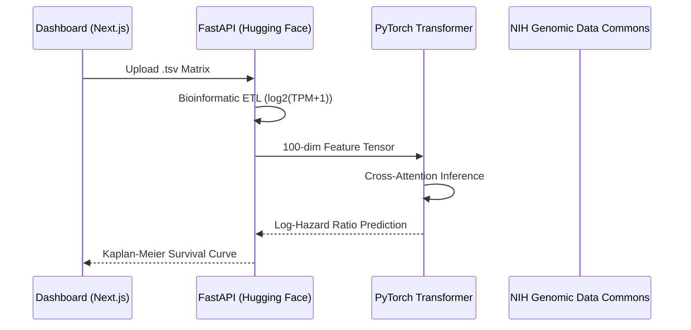

# Multimodal Cancer Survival Transformer (MCST)

[](https://www.python.org/)
[](https://pytorch.org/)
[](https://fastapi.tiangolo.com/)
[](https://nextjs.org/)
[](https://huggingface.co/)
[](https://vercel.com/)
[](https://www.docker.com/)

## Overview
The **Multimodal Cancer Survival Transformer (MCST)** is an enterprise-grade medical AI pipeline. It integrates genomic transcriptomic data (RNA-Seq) with cross-attention transformer architectures to predict patient survival outcomes (hazard ratios) in oncology. This system serves as a research prototype demonstrating a production-ready path from raw NIH GDC clinical data to real-time clinical inference.

---

## 🏗 System Architecture
The pipeline utilizes a decoupled architecture, separating high-compute model inference from the reactive frontend dashboard.



---

## 🚀 Key Pipeline Stages

### 1. Data Ingestion & ETL

Raw TCGA RNA-Seq matrices are processed via an automated pipeline:

* **Filtering:** Isolation of protein-coding genes.
* **Normalization:** $log_2(\text{TPM} + 1)$ transformation.
* **Vectorization:** Reduction to a 100-dimensional highly-expressed signature vector.

### 2. Deep Learning Core

The brain of the system is a **Multimodal Cross-Attention Transformer**:

* **Genomic Projector:** Maps clinical genomic features into the shared latent space.
* **Cross-Attention Layer:** Computes relevance between genomic signatures and pathological features.
* **Cox Loss Optimization:** Training utilizes partial likelihood estimation to model continuous survival time.

### 3. Production Deployment

* **Backend:** FastAPI containerized via Docker on Hugging Face Spaces.
* **Frontend:** Next.js application deployed on the Vercel Edge Network.
* **Weights Management:** PyTorch `.pth` serialization managed via Git LFS.

---

## 🛠 Getting Started

### Prerequisites

* [Node.js](https://nodejs.org/) (v18+)
* [Python](https://www.python.org/) (v3.12+)
* [Git LFS](https://git-lfs.com/)

### Cloning & Setup

```bash
# Clone the repository
git clone [https://github.com/engrmaziz/multimodal-cancer-survival-transformer.git](https://github.com/engrmaziz/multimodal-cancer-survival-transformer.git)
cd multimodal-cancer-survival-transformer

# Setup Backend
cd backend
pip install -r requirements.txt
uvicorn main:app --reload

# Setup Frontend
cd ../frontend
npm install
# Set NEXT_PUBLIC_API_BASE_URL in .env.local
npm run dev

```

---

## 🧬 Research Reproducibility

The training protocols and data engineering scripts are encapsulated in the research notebook located at `/research/Cancer_Survival_Transformer.ipynb`. This notebook documents the transition from NIH GDC manifest queries to final weight optimization.

---

## 🛡 Disclaimer

*This project is a research prototype intended for academic verification. It does not provide medical diagnoses or clinical advice. All genomic processing follows standard TCGA-BRCA data access protocols.*
